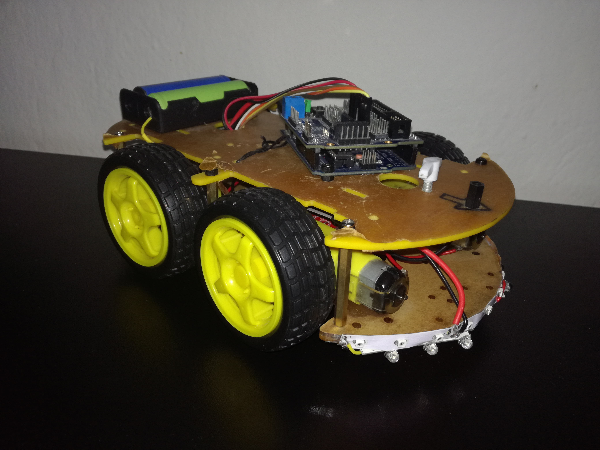
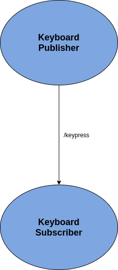

# RoboCar Control with ROS and Arduino UNO
_project by Davor Dimoski_

## 1.1. Idea

The idea behind this project is to use ROS publish/subscribe communication to control the movement of an Arduino RoboCar. Upon a key press on the keyboard, we want to publish the value of the key that has been pressed to a topic and we want to subscribe to that topic in order to read the value of the pressed key. Based on the key that has been pressed, we will control the movement of the robot in 4 directions: forward, backward, left and right.

## 1.2. Hardware
The main components that are part of the RoboCar are:
- L298N Motor Driver Board
- Arduino UNO 328 Control Panel
- Arduino Sensor Expansion Board V5
- 4 DC Motors

## 1.3 Implementation

### 1.3.1. Arduino Code Set Up

This is the connection of the pins on Arduino and constants which will be used later in the code:

     #define in1 4
     #define in2 5
     #define in3 6
     #define in4 7 
     #define enA 9 
     #define enB 11 
     
     // The amount of time for movement on a single key press
     const int DELAY_TIME = 400;
    
     // Speed for the wheels
     const int SPEED = 190;
     
In the set up function before we enter the main loop we set all the pins to output and initialize the motor pins to low:
      
      pinMode(enA, OUTPUT);
      pinMode(enB, OUTPUT);
      pinMode(in1, OUTPUT);
      pinMode(in2, OUTPUT);
      
      pinMode(in3, OUTPUT);
      pinMode(in4, OUTPUT);
    
      //initial direction of the motors
      digitalWrite(in1, LOW);
      digitalWrite(in2, LOW);
      digitalWrite(in3, LOW);
      digitalWrite(in4, LOW);
      
There are 4 methods for moving the RoboCar in each of the 4 directions. In the below code block we have the function `move_forward()` which sets the values of the
motors on all wheels to LOW and HIGH accordingly. In order to move the robot we need to send a signal to the enA and enB to move the motors. 
The speed is specified in a constant `SPEED`, while the amount of time for which the robot will be moving is specified with a constant named `DELAY_TIME`. 
After the specified time passes we send a signal with value 0 to the motors to stop them from moving any further.

     void move_forward() {
          // Set Motor A forward
          digitalWrite(in1, LOW);
          digitalWrite(in2, HIGH);
          // Set Motor B forward
          digitalWrite(in3, LOW);
          digitalWrite(in4, HIGH);
    
          analogWrite(enA, SPEED);
          analogWrite(enB, SPEED);
          delay(DELAY_TIME);
          analogWrite(enA, 0);
          analogWrite(enB, 0);
     }

### 1.3.2. Overview of ROS communication
What we are trying to achieve is establish a connection between the PC’s keyboard and the Arduino in order to control the RoboCar. To do that we’re using rosserial communication. We have 2 nodes:

- **Keyboard Publisher** – this node reads the value of what key the user has pressed and it publishes that data on the topic `/keypress`
- **Keyboard Subscriber** – this node subscribes to the topic `/keypress` and therefore receives the data which lets us know what key the user has pressed on their keyboard

On the following image you can see visual representation of the connection between the nodes and the topic.

### 1.3.3. Keyboard Publisher

Keyboard Publisher is a node that’s implemented in Python.

_Note: This base of the code for `KeyPublisher.py` was taken from <a href="https://answers.ros.org/question/315716/python-node-for-publishing-keyboard-events/">here</a> and it was further adapted accordingly to the needs of this project._ 

We have a class named `KeyboardPublisher` which has a property of type Publisher named `keyboard_publisher`. The node publishes data of type String to the topic `/keypress` with a buffer/queue size of 1 (we need to send data after each pressed character). After that we initialize the node.

In the main function we initialize a variable `keyboard_publisher` which is an instance of our class `KeyboardPublisher` and then we call the internal method `keyboard_listener()` which waits for the user’s input and gives it to us an object of type `KeyCode`. We cast this object to a `String` and then we  publish it on the topic. When the user presses the key `ESC` the communication ends.

      def keyboard_listener(self):
        # Collect events until released
        with Listener(
                on_press=self.on_press,
                on_release=self.on_release) as listener:
            listener.join()

      def on_press(self, key):
        pressed_key = String(data = str(key))
        self.publish_keypress(pressed_key)

      def on_release(self, key):
        if key == Key.esc:
            # Stop listener
            return False
              
      def publish_keypress(self, key_press):
        self.keyboard_publisher.publish(key_press)

### 1.3.4. Keyboard Subscriber

The subscriber is located in the Arduino code. We create a node handler which we initialize in the Arduino set up function. We also create a Subscriber to which the note handler subscribes to in the set up function.

Every time data is sent to the `/keypress` topic the function `callback_message` is called. In that function, first we cast the data to `String`, then we check whether the key that has been pressed is up, down, left or right and accordingly we call the appropriate function depending on the data.

     void callback_message(const std_msgs::String& pressed_key){
       nh.loginfo(pressed_key.data);
       String message = String(pressed_key.data);

       if(message.equals("Key.up")) 
         move_forward();
       if(message.equals("Key.down"))
         move_backward();
       if(message.equals("Key.left")) 
         move_left();
       if(message.equals("Key.right")) 
         move_right();
    }
    
    

## 1.4. Starting the application

In order to start the application, the local machine needs to have ROS installed and started with the command:

     roscore
     
The publisher can be started with the code:

     rosrun robocar KeyboardPublisher.py
     
The subscriber can be started with the code:

     rosrun rosserial python serial_node.py /dev/tty[name of USB device connected to the hardware]
